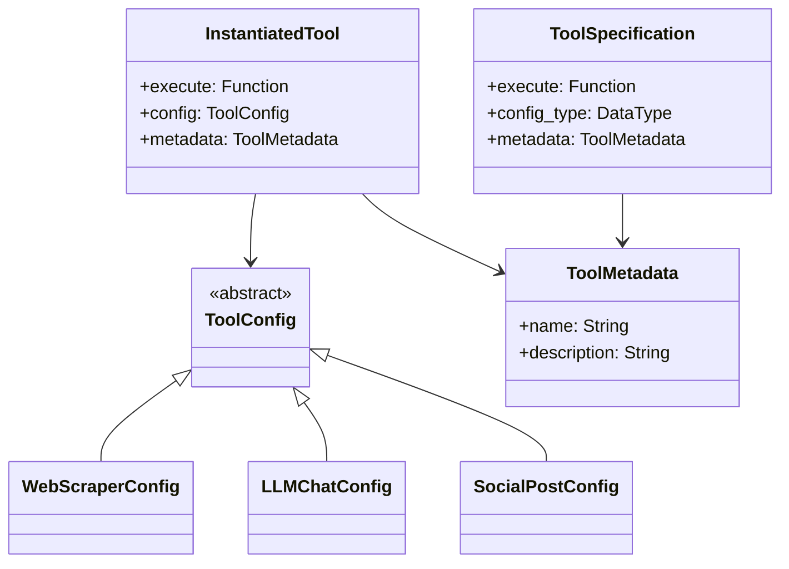
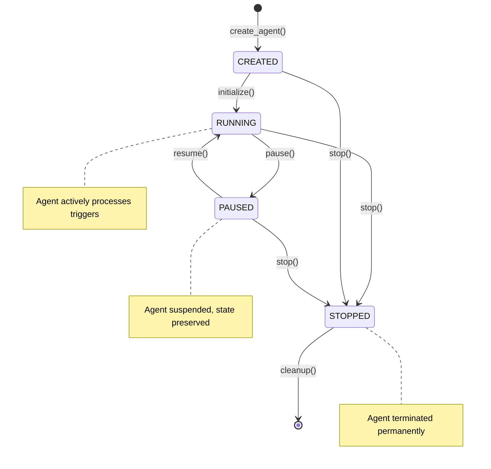
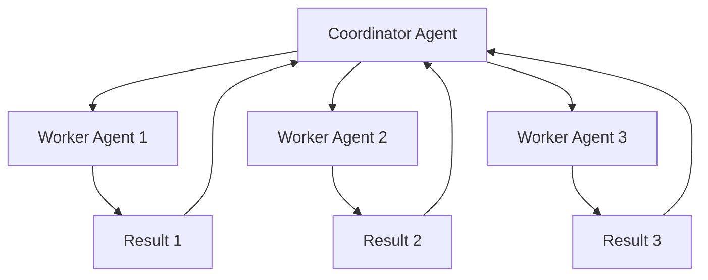
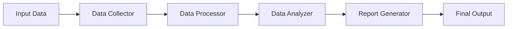
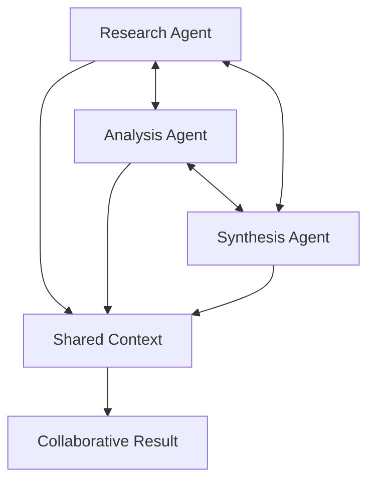

# JuliaSphere Agent Architecture & Logic Documentation

This document provides a comprehensive technical overview of the JuliaSphere agent system, including architecture, execution patterns, and implementation details.

## Table of Contents

1. [Agent System Overview](#agent-system-overview)
2. [Core Components](#core-components)
3. [Agent Lifecycle](#agent-lifecycle)
4. [Tool System](#tool-system)
5. [Strategy System](#strategy-system)
6. [Trigger System](#trigger-system)
7. [Swarm Intelligence](#swarm-intelligence)
8. [Performance & Monitoring](#performance--monitoring)
9. [Security Model](#security-model)
10. [Development Patterns](#development-patterns)

## Agent System Overview

JuliaSphere agents are autonomous software entities designed to perform specific tasks using a combination of tools, strategies, and triggers. Each agent operates within a secure, monitored environment and can collaborate with other agents to form intelligent swarms.

### Design Principles

1. **Modularity**: Components are interchangeable and composable
2. **Type Safety**: Strong typing throughout the Julia codebase
3. **Performance**: Optimized for high-throughput execution
4. **Security**: Sandboxed execution with comprehensive audit trails
5. **Observability**: Full logging and monitoring capabilities

### Agent Definition

```julia
"""
    Agent

Core agent structure representing an autonomous AI entity.

An agent combines tools, strategies, and triggers to perform tasks autonomously
within the JuliaSphere ecosystem. Each agent maintains its own context and
execution state.
"""
struct Agent
    id::String                      # Unique identifier
    name::String                    # Human-readable name
    description::String             # Purpose description
    context::AgentContext           # Runtime context and tools
    strategy::InstantiatedStrategy  # Execution strategy
    trigger::InstantiatedTrigger   # Activation mechanism
    state::AgentState              # Current execution state
    created_at::DateTime           # Creation timestamp
    updated_at::DateTime           # Last modification timestamp
end
```

## Core Components

### 1. Agent Context

The agent context maintains the runtime environment and available resources:

```julia
"""
    AgentContext

Runtime context for agent execution containing tools, logs, and state.

The context provides agents with access to their configured tools and maintains
a history of execution logs for monitoring and debugging purposes.
"""
struct AgentContext
    tools::Vector{InstantiatedTool}  # Available tools for execution
    logs::Vector{String}             # Execution history logs
    metadata::Dict{String, Any}      # Custom metadata storage
    execution_count::Int             # Number of times agent has run
    last_execution::Union{DateTime, Nothing}  # Last execution timestamp
end
```

### 2. Tool System Architecture

Tools provide agents with specific capabilities:



### 3. Strategy System Architecture

Strategies define agent reasoning and execution patterns:

```julia
"""
    StrategySpecification

Specification for agent execution strategies.

Strategies define how agents process inputs, reason about tasks, and coordinate
tool usage to achieve desired outcomes.
"""
struct StrategySpecification
    execute::Function               # Strategy execution function
    initialize::Union{Function, Nothing}  # Optional initialization
    config_type::DataType          # Configuration type
    input_type::Union{DataType, Nothing}  # Input type (if any)
    metadata::StrategyMetadata      # Strategy metadata
end
```

## Agent Lifecycle

### State Machine



### Lifecycle Functions

```julia
"""
    create_agent(id, name, description, blueprint) -> Agent

Create a new agent with the specified configuration.

# Arguments
- `id::String`: Unique identifier for the agent
- `name::String`: Human-readable name
- `description::String`: Description of agent purpose
- `blueprint::AgentBlueprint`: Configuration blueprint

# Returns
- `Agent`: Newly created agent instance

# Example
```julia
blueprint = AgentBlueprint(
    tools=[ToolBlueprint("web_scraper", Dict("timeout" => 30))],
    strategy=StrategyBlueprint("plan_and_execute", Dict()),
    trigger=TriggerConfig(SCHEDULE_TRIGGER, Dict("cron" => "0 9 * * *"))
)

agent = create_agent("news-bot", "News Aggregator", 
                    "Scrapes and summarizes news", blueprint)
```
"""
function create_agent(id::String, name::String, description::String, 
                     blueprint::AgentBlueprint)::Agent
    # Validate inputs
    _validate_agent_parameters(id, name, description, blueprint)
    
    # Instantiate tools
    tools = _instantiate_tools(blueprint.tools)
    
    # Create agent context
    context = AgentContext(tools, String[], Dict{String, Any}(), 0, nothing)
    
    # Instantiate strategy
    strategy = _instantiate_strategy(blueprint.strategy, context)
    
    # Instantiate trigger
    trigger = _instantiate_trigger(blueprint.trigger)
    
    # Create agent
    agent = Agent(
        id, name, description, context, strategy, trigger,
        CREATED_STATE, now(), now()
    )
    
    # Store in global registry
    AGENTS[id] = agent
    
    # Log creation
    StructuredLogger.log_info(
        "Agent created successfully";
        agent_id=id,
        metadata=Dict("name" => name, "tools_count" => length(tools))
    )
    
    return agent
end

"""
    initialize(agent::Agent)

Initialize an agent and transition to RUNNING state.

This function prepares the agent for execution by calling any strategy
initialization functions and setting up trigger monitoring.
"""
function initialize(agent::Agent)
    if agent.state != CREATED_STATE
        throw(ArgumentError("Agent must be in CREATED state to initialize"))
    end
    
    try
        # Initialize strategy if needed
        if agent.strategy.initialize !== nothing
            agent.strategy.initialize(agent.strategy.config, agent.context)
        end
        
        # Set up trigger monitoring
        _setup_trigger_monitoring(agent)
        
        # Update state
        set_agent_state(agent, RUNNING_STATE)
        
        StructuredLogger.log_info(
            "Agent initialized successfully";
            agent_id=agent.id
        )
        
    catch e
        StructuredLogger.log_error(
            "Agent initialization failed";
            agent_id=agent.id,
            exception=e
        )
        rethrow(e)
    end
end
```

## Tool System

### Tool Implementation Pattern

All tools follow a consistent implementation pattern:

```julia
# 1. Define configuration struct
struct WebScraperConfig <: ToolConfig
    url::String
    timeout_seconds::Int
    extract_text_only::Bool
    user_agent::String
    
    # Constructor with validation
    function WebScraperConfig(url::String, timeout_seconds::Int=30,
                             extract_text_only::Bool=true,
                             user_agent::String="JuliaSphere-Agent/1.0")
        # Validate URL
        isempty(url) && throw(ArgumentError("URL cannot be empty"))
        !occursin(r"^https?://", url) && throw(ArgumentError("Invalid URL format"))
        
        # Validate timeout
        timeout_seconds <= 0 && throw(ArgumentError("Timeout must be positive"))
        
        return new(url, timeout_seconds, extract_text_only, user_agent)
    end
end

# 2. Implement execution function
"""
    web_scraper_execute(config::WebScraperConfig) -> Dict{String, Any}

Execute web scraping operation based on configuration.

# Arguments
- `config::WebScraperConfig`: Scraping configuration

# Returns
- `Dict{String, Any}`: Results containing content, metadata, and status

# Throws
- `NetworkError`: If request fails
- `TimeoutError`: If request times out
- `ArgumentError`: If configuration is invalid
"""
function web_scraper_execute(config::WebScraperConfig)::Dict{String, Any}
    timer = StructuredLogger.PerformanceTimer("web_scraper_execute")
    
    try
        # Prepare request
        headers = ["User-Agent" => config.user_agent]
        
        # Make HTTP request with timeout
        response = HTTP.get(config.url; 
                          timeout=config.timeout_seconds,
                          headers=headers)
        
        # Extract content
        content = String(response.body)
        processed_content = config.extract_text_only ? 
                          _extract_text_content(content) : content
        
        # Prepare result
        result = Dict{String, Any}(
            "content" => processed_content,
            "url" => config.url,
            "status_code" => response.status,
            "content_type" => get(Dict(response.headers), "Content-Type", "unknown"),
            "content_length" => length(processed_content),
            "timestamp" => string(now())
        )
        
        StructuredLogger.finish_timer(timer; status="completed")
        return result
        
    catch e
        StructuredLogger.finish_timer(timer; status="failed")
        
        if isa(e, HTTP.TimeoutError)
            throw(TimeoutError("Web scraping request timed out after $(config.timeout_seconds) seconds"))
        elseif isa(e, HTTP.StatusError)
            throw(NetworkError("HTTP request failed with status $(e.status)"))
        else
            rethrow(e)
        end
    end
end

# 3. Create tool specification
const WEB_SCRAPER_SPECIFICATION = ToolSpecification(
    web_scraper_execute,
    WebScraperConfig,
    ToolMetadata(
        "web_scraper",
        "Scrapes content from web pages with configurable options"
    )
)
```

### Available Tools

| Tool Name | Purpose | Configuration Options |
|-----------|---------|---------------------|
| `web_scraper` | Web content extraction | URL, timeout, text extraction |
| `llm_chat` | AI language model interaction | Model, temperature, max tokens |
| `content_summarizer` | Text summarization | Max length, style, language |
| `social_poster` | Social media publishing | Platform, credentials, formatting |
| `email_sender` | Email communication | SMTP config, templates |
| `file_processor` | File operations | Path, encoding, operations |
| `database_query` | Database operations | Connection, query, parameters |
| `image_generator` | AI image generation | Model, prompt, dimensions |

## Strategy System

### Strategy Types

#### 1. Reactive Strategy
Direct input-to-output mapping with minimal reasoning:

```julia
"""
Reactive strategy for simple input-output transformations.

This strategy directly applies tools to inputs without complex reasoning
or planning. Suitable for straightforward tasks with clear tool mappings.
"""
function reactive_strategy_execute(config::ReactiveStrategyConfig, 
                                 context::AgentContext, 
                                 input::Dict{String, Any})
    # Find appropriate tool based on input
    tool = _select_tool_for_input(input, context.tools)
    
    # Execute tool directly
    result = tool.execute(input)
    
    return Dict{String, Any}(
        "output" => result,
        "strategy" => "reactive",
        "tool_used" => tool.metadata.name
    )
end
```

#### 2. Plan and Execute Strategy
Multi-step reasoning with explicit planning:

```julia
"""
Plan and execute strategy for complex, multi-step tasks.

This strategy analyzes the input, creates an execution plan, and then
executes the plan step by step using available tools.
"""
function plan_and_execute_strategy_execute(config::PlanAndExecuteConfig,
                                         context::AgentContext,
                                         input::Dict{String, Any})
    # Step 1: Analyze the task
    task_analysis = _analyze_task(input, context.tools)
    
    # Step 2: Create execution plan
    plan = _create_execution_plan(task_analysis, config)
    
    # Step 3: Execute plan steps
    results = []
    for (i, step) in enumerate(plan.steps)
        step_result = _execute_plan_step(step, context.tools, results)
        push!(results, step_result)
        
        # Log progress
        StructuredLogger.log_debug(
            "Plan step completed";
            metadata=Dict("step" => i, "total_steps" => length(plan.steps))
        )
    end
    
    # Step 4: Synthesize final output
    final_output = _synthesize_results(results, plan.output_format)
    
    return Dict{String, Any}(
        "output" => final_output,
        "strategy" => "plan_and_execute",
        "plan" => plan,
        "step_results" => results
    )
end
```

#### 3. Collaborative Strategy
Multi-agent coordination:

```julia
"""
Collaborative strategy for multi-agent coordination.

This strategy can coordinate with other agents to accomplish complex
tasks that require multiple specialized capabilities.
"""
function collaborative_strategy_execute(config::CollaborativeConfig,
                                      context::AgentContext,
                                      input::Dict{String, Any})
    # Identify required capabilities
    required_capabilities = _analyze_required_capabilities(input)
    
    # Find suitable collaborator agents
    collaborators = _find_collaborator_agents(required_capabilities)
    
    # Create coordination plan
    coordination_plan = _create_coordination_plan(input, collaborators)
    
    # Execute collaborative workflow
    workflow_result = _execute_collaborative_workflow(coordination_plan)
    
    return workflow_result
end
```

## Trigger System

### Trigger Types and Implementation

#### 1. Schedule Trigger

```julia
"""
Schedule trigger for time-based agent execution.

Uses cron-like expressions to define execution schedules.
"""
struct ScheduleTriggerParams <: TriggerParams
    cron_expression::String
    timezone::String
    max_executions::Union{Int, Nothing}
    
    function ScheduleTriggerParams(cron_expression::String, 
                                 timezone::String="UTC",
                                 max_executions::Union{Int, Nothing}=nothing)
        # Validate cron expression
        _validate_cron_expression(cron_expression)
        
        return new(cron_expression, timezone, max_executions)
    end
end

function schedule_trigger_monitor(params::ScheduleTriggerParams, agent::Agent)
    @async begin
        execution_count = 0
        
        while agent.state == RUNNING_STATE
            # Calculate next execution time
            next_execution = _calculate_next_execution(params.cron_expression, 
                                                     params.timezone)
            
            # Wait until next execution time
            sleep_duration = next_execution - now()
            if sleep_duration > Dates.Second(0)
                sleep(sleep_duration.value / 1000)  # Convert to seconds
            end
            
            # Check if agent is still running and within execution limits
            if agent.state == RUNNING_STATE && 
               (params.max_executions === nothing || 
                execution_count < params.max_executions)
                
                # Trigger agent execution
                _execute_agent(agent)
                execution_count += 1
            end
        end
    end
end
```

#### 2. Webhook Trigger

```julia
"""
Webhook trigger for HTTP request-based execution.

Allows agents to be triggered by external HTTP requests.
"""
struct WebhookTriggerParams <: TriggerParams
    endpoint_path::String
    authentication_required::Bool
    allowed_methods::Vector{String}
    allowed_origins::Union{Vector{String}, Nothing}
    
    function WebhookTriggerParams(endpoint_path::String,
                                authentication_required::Bool=true,
                                allowed_methods::Vector{String}=["POST"],
                                allowed_origins::Union{Vector{String}, Nothing}=nothing)
        # Validate endpoint path
        !startswith(endpoint_path, "/") && 
            throw(ArgumentError("Endpoint path must start with '/'"))
        
        return new(endpoint_path, authentication_required, 
                  allowed_methods, allowed_origins)
    end
end

function webhook_trigger_setup(params::WebhookTriggerParams, agent::Agent)
    # Register webhook endpoint with HTTP router
    endpoint = params.endpoint_path
    
    handler = function(req::HTTP.Request)
        # Validate request method
        if !(req.method in params.allowed_methods)
            return HTTP.Response(405, "Method not allowed")
        end
        
        # Check authentication if required
        if params.authentication_required
            auth_result = _validate_webhook_authentication(req)
            if !auth_result.valid
                return HTTP.Response(401, "Authentication required")
            end
        end
        
        # Validate origin if specified
        if params.allowed_origins !== nothing
            origin = get(Dict(req.headers), "Origin", "")
            if !(origin in params.allowed_origins)
                return HTTP.Response(403, "Origin not allowed")
            end
        end
        
        # Parse request body
        input_data = _parse_webhook_input(req)
        
        # Execute agent with input data
        try
            result = _execute_agent(agent, input_data)
            return HTTP.Response(200, JSON3.write(result))
        catch e
            StructuredLogger.log_error(
                "Webhook execution failed";
                agent_id=agent.id,
                exception=e
            )
            return HTTP.Response(500, "Execution failed")
        end
    end
    
    # Register with global HTTP router
    HTTP.register!(GLOBAL_ROUTER, "POST", endpoint, handler)
end
```

## Swarm Intelligence

### Swarm Detection Algorithm

```julia
"""
Detect agent interactions and build swarm topologies.

Analyzes agent execution logs to identify coordination patterns and
automatically forms optimized swarm structures.
"""
function detect_and_optimize_swarms(time_window_hours::Int=24)::Vector{SwarmTopology}
    # Step 1: Gather execution data
    execution_logs = _gather_execution_logs(time_window_hours)
    
    # Step 2: Detect interaction patterns
    interactions = _analyze_interaction_patterns(execution_logs)
    
    # Step 3: Classify interaction types
    classified_interactions = _classify_interactions(interactions)
    
    # Step 4: Build swarm topologies using graph algorithms
    swarms = _build_swarm_topologies(classified_interactions)
    
    # Step 5: Optimize swarm configurations
    optimized_swarms = _optimize_swarm_configurations(swarms)
    
    # Step 6: Persist swarm data
    for swarm in optimized_swarms
        _persist_swarm_topology(swarm)
    end
    
    StructuredLogger.log_info(
        "Swarm detection completed";
        metadata=Dict(
            "swarms_detected" => length(optimized_swarms),
            "total_agents" => sum(length(s.agents) for s in optimized_swarms),
            "time_window_hours" => time_window_hours
        )
    )
    
    return optimized_swarms
end
```

### Coordination Patterns

#### 1. Hierarchical Pattern
One coordinator agent delegates tasks to multiple worker agents:



#### 2. Pipeline Pattern
Sequential processing chain:



#### 3. Collaborative Pattern
Bidirectional cooperation:



## Performance & Monitoring

### Execution Tracking

```julia
"""
Track agent execution with comprehensive metrics collection.

Provides detailed performance analytics and monitoring capabilities
for all agent operations.
"""
function track_agent_execution(agent::Agent, input::Any, execution_function::Function)
    # Start execution tracking
    execution_id = AgentAnalytics.start_execution_tracking(
        agent.id;
        input_data=input
    )
    
    start_time = now()
    tools_used = String[]
    
    try
        # Execute with monitoring
        result = execution_function()
        
        # Calculate metrics
        duration_ms = Int(round((now() - start_time).value))
        
        # Complete tracking
        AgentAnalytics.complete_execution_tracking(
            execution_id;
            status="completed",
            output_data=result,
            tools_used=tools_used,
            cost_incurred=_calculate_execution_cost(duration_ms, tools_used)
        )
        
        # Update agent context
        agent.context.execution_count += 1
        agent.context.last_execution = now()
        
        # Log success
        StructuredLogger.log_agent_execution(
            "completed",
            agent.id;
            execution_id=string(execution_id),
            duration_ms=duration_ms,
            tools_used=tools_used,
            status="completed"
        )
        
        return result
        
    catch e
        # Handle execution failure
        duration_ms = Int(round((now() - start_time).value))
        
        AgentAnalytics.complete_execution_tracking(
            execution_id;
            status="failed",
            error_message=string(e),
            tools_used=tools_used
        )
        
        StructuredLogger.log_agent_execution(
            "failed",
            agent.id;
            execution_id=string(execution_id),
            duration_ms=duration_ms,
            tools_used=tools_used,
            status="failed",
            error_message=string(e)
        )
        
        rethrow(e)
    end
end
```

### Health Scoring Algorithm

```julia
"""
Calculate comprehensive health score for an agent.

Combines multiple metrics to provide a single health indicator:
- Performance score (0-25): Success rate and execution speed
- Reliability score (0-25): Consistency and uptime  
- Efficiency score (0-25): Resource usage and cost
- User satisfaction (0-25): Ratings and reviews
"""
function calculate_agent_health_score(agent_id::String)::AgentHealthScore
    perf_metrics = calculate_agent_performance(agent_id)
    
    if perf_metrics === nothing
        return _default_health_score(agent_id)
    end
    
    # Performance score (0-25)
    performance_score = _calculate_performance_score(perf_metrics)
    
    # Reliability score (0-25) 
    reliability_score = _calculate_reliability_score(perf_metrics)
    
    # Efficiency score (0-25)
    efficiency_score = _calculate_efficiency_score(perf_metrics)
    
    # User satisfaction score (0-25)
    satisfaction_score = _calculate_satisfaction_score(agent_id)
    
    # Overall score
    overall_score = performance_score + reliability_score + 
                   efficiency_score + satisfaction_score
    
    return AgentHealthScore(
        agent_id,
        overall_score,
        performance_score,
        reliability_score, 
        efficiency_score,
        satisfaction_score,
        now()
    )
end
```

## Security Model

### Execution Sandboxing

```julia
"""
Execute agent code in a secure sandbox environment.

Provides isolation and resource limiting to prevent malicious behavior
or resource exhaustion.
"""
function execute_in_sandbox(agent::Agent, execution_function::Function)
    sandbox_config = SandboxConfig(
        max_memory_mb=512,
        max_cpu_percent=80,
        max_execution_time_seconds=300,
        allowed_network_hosts=_get_allowed_hosts(agent),
        allowed_file_paths=_get_allowed_paths(agent)
    )
    
    try
        # Enter sandbox
        _enter_sandbox(sandbox_config)
        
        # Execute with resource monitoring
        result = _execute_with_monitoring(agent, execution_function)
        
        return result
        
    finally
        # Always exit sandbox
        _exit_sandbox()
    end
end
```

### Permission Management

```julia
"""
Agent permission system for fine-grained access control.

Manages what resources and capabilities each agent can access.
"""
struct AgentPermissions
    can_access_network::Bool
    can_read_files::Bool  
    can_write_files::Bool
    can_execute_system_commands::Bool
    allowed_tools::Vector{String}
    allowed_apis::Vector{String}
    max_cost_per_execution::Float64
end

function check_agent_permissions(agent::Agent, requested_action::String)::Bool
    permissions = _get_agent_permissions(agent.id)
    
    return _validate_action_against_permissions(requested_action, permissions)
end
```

## Development Patterns

### Creating Custom Tools

```julia
# 1. Define configuration struct inheriting from ToolConfig
struct MyCustomToolConfig <: ToolConfig
    parameter1::String
    parameter2::Int
    
    # Add validation in constructor
    function MyCustomToolConfig(p1::String, p2::Int)
        isempty(p1) && throw(ArgumentError("Parameter1 cannot be empty"))
        p2 <= 0 && throw(ArgumentError("Parameter2 must be positive"))
        return new(p1, p2)
    end
end

# 2. Implement execution function
function my_custom_tool_execute(config::MyCustomToolConfig)::Dict{String, Any}
    # Implement tool logic here
    result = perform_custom_operation(config.parameter1, config.parameter2)
    
    return Dict{String, Any}(
        "result" => result,
        "timestamp" => string(now()),
        "config_used" => config
    )
end

# 3. Create specification
const MY_CUSTOM_TOOL_SPECIFICATION = ToolSpecification(
    my_custom_tool_execute,
    MyCustomToolConfig, 
    ToolMetadata(
        "my_custom_tool",
        "Description of what this tool does"
    )
)

# 4. Register in Tools.jl
register_tool(MY_CUSTOM_TOOL_SPECIFICATION)
```

### Creating Custom Strategies

```julia
# 1. Define configuration struct
struct MyCustomStrategyConfig <: StrategyConfig
    reasoning_depth::Int
    use_external_apis::Bool
end

# 2. Define input struct (optional)
struct MyCustomStrategyInput
    query::String
    context::Dict{String, Any}
end

# 3. Implement strategy function  
function my_custom_strategy_execute(config::MyCustomStrategyConfig,
                                  context::AgentContext,
                                  input::MyCustomStrategyInput)
    # Implement strategy logic
    analysis_result = _analyze_query(input.query, config.reasoning_depth)
    
    # Select and use appropriate tools
    selected_tools = _select_tools_for_task(analysis_result, context.tools)
    
    # Execute tools
    tool_results = []
    for tool in selected_tools
        result = tool.execute(_prepare_tool_input(analysis_result, tool))
        push!(tool_results, result)
    end
    
    # Synthesize final result
    final_result = _synthesize_tool_results(tool_results)
    
    return Dict{String, Any}(
        "output" => final_result,
        "analysis" => analysis_result,
        "tools_used" => [t.metadata.name for t in selected_tools]
    )
end

# 4. Create specification
const MY_CUSTOM_STRATEGY_SPECIFICATION = StrategySpecification(
    my_custom_strategy_execute,
    nothing,  # No initialization function
    MyCustomStrategyConfig,
    MyCustomStrategyInput,
    StrategyMetadata(
        "my_custom_strategy", 
        "Custom strategy for specialized task handling"
    )
)

# 5. Register in Strategies.jl
register_strategy(MY_CUSTOM_STRATEGY_SPECIFICATION)
```

This comprehensive documentation provides developers with the knowledge needed to understand, extend, and maintain the JuliaSphere agent system effectively.