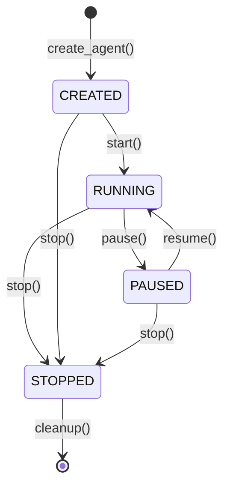

# JuliaOS API Documentation

Complete REST API reference for the JuliaOS Backend server.

## Table of Contents

1. [Overview](#overview)
2. [Authentication](#authentication)
3. [Base URLs](#base-urls)
4. [Common Patterns](#common-patterns)
5. [Error Handling](#error-handling)
6. [Rate Limiting](#rate-limiting)
7. [API Endpoints](#api-endpoints)
8. [Data Models](#data-models)
9. [SDK Examples](#sdk-examples)
10. [WebSocket Events](#websocket-events)

## Overview

The JuliaOS API is a RESTful service that provides comprehensive agent management, execution, and monitoring capabilities. The API follows OpenAPI 3.1.0 specification and supports JSON request/response formats.

### API Version
- **Current Version**: 0.1.0
- **Base Path**: `/api/v1`
- **Protocol**: HTTP/HTTPS
- **Content Type**: `application/json`

### Key Features
- **Agent Lifecycle Management**: Create, read, update, delete agents
- **Real-time Execution**: Trigger agents via webhooks or schedules
- **Tool & Strategy Discovery**: Browse available tools and strategies
- **Logging & Monitoring**: Access execution logs and outputs
- **Type Safety**: JSON Schema validation for all requests

## Authentication

### API Key Authentication (Recommended)

Include your API key in the request header:

```http
X-API-Key: your-api-key-here
```

### JWT Token Authentication

For user-specific operations, use JWT tokens:

```http
Authorization: Bearer your-jwt-token-here
```

### Example with Authentication

```bash
curl -X GET "https://api.juliaos.com/api/v1/agents" \
  -H "X-API-Key: your-api-key" \
  -H "Content-Type: application/json"
```

## Base URLs

| Environment | Base URL | Description |
|-------------|----------|-------------|
| **Production** | `https://api.juliaos.com` | Live production API |
| **Staging** | `https://staging-api.juliaos.com` | Pre-production testing |
| **Development** | `http://localhost:8052` | Local development server |

## Common Patterns

### Request/Response Format

All API requests and responses use JSON format with consistent structure:

**Request:**
```json
{
  "data": {
    // Request payload
  },
  "metadata": {
    "timestamp": "2024-01-01T12:00:00Z",
    "request_id": "req_123456789"
  }
}
```

**Response:**
```json
{
  "data": {
    // Response data
  },
  "metadata": {
    "timestamp": "2024-01-01T12:00:00Z",
    "request_id": "req_123456789",
    "processing_time_ms": 150
  }
}
```

### Pagination

List endpoints support pagination using cursor-based pagination:

**Request:**
```http
GET /api/v1/agents?limit=20&cursor=eyJpZCI6ImFnZW50XzEyMyJ9
```

**Response:**
```json
{
  "data": [...],
  "pagination": {
    "has_more": true,
    "next_cursor": "eyJpZCI6ImFnZW50XzQ1NiJ9",
    "total_count": 150,
    "limit": 20
  }
}
```

### Filtering & Sorting

Most list endpoints support filtering and sorting:

```http
GET /api/v1/agents?filter[state]=RUNNING&sort=created_at:desc&limit=10
```

## Error Handling

### HTTP Status Codes

| Code | Status | Description |
|------|--------|-------------|
| `200` | OK | Request successful |
| `201` | Created | Resource created successfully |
| `204` | No Content | Request successful, no response body |
| `400` | Bad Request | Invalid request format or parameters |
| `401` | Unauthorized | Authentication required |
| `403` | Forbidden | Insufficient permissions |
| `404` | Not Found | Resource not found |
| `409` | Conflict | Resource already exists or state conflict |
| `422` | Unprocessable Entity | Validation errors |
| `429` | Too Many Requests | Rate limit exceeded |
| `500` | Internal Server Error | Server error |
| `503` | Service Unavailable | Server temporarily unavailable |

### Error Response Format

```json
{
  "error": {
    "code": "VALIDATION_ERROR",
    "message": "Request validation failed",
    "details": {
      "field": "agent.name",
      "reason": "Name must be between 1 and 100 characters"
    },
    "request_id": "req_123456789",
    "timestamp": "2024-01-01T12:00:00Z"
  }
}
```

### Common Error Codes

| Error Code | Description | Resolution |
|------------|-------------|------------|
| `INVALID_API_KEY` | API key is missing or invalid | Check your API key configuration |
| `RATE_LIMIT_EXCEEDED` | Too many requests | Reduce request frequency or upgrade plan |
| `AGENT_NOT_FOUND` | Agent ID doesn't exist | Verify the agent ID |
| `INVALID_STATE_TRANSITION` | Cannot change agent to requested state | Check current agent state |
| `TOOL_NOT_AVAILABLE` | Requested tool is not registered | Use `/tools` endpoint to see available tools |
| `STRATEGY_NOT_AVAILABLE` | Requested strategy is not registered | Use `/strategies` endpoint to see available strategies |

## Rate Limiting

API requests are rate limited to ensure fair usage and system stability.

### Rate Limits

| Plan | Requests per minute | Concurrent agents | Webhook triggers per hour |
|------|-------------------|------------------|------------------------|
| **Free** | 100 | 5 | 1,000 |
| **Developer** | 1,000 | 25 | 10,000 |
| **Professional** | 5,000 | 100 | 50,000 |
| **Enterprise** | Custom | Custom | Custom |

### Rate Limit Headers

Response headers indicate current rate limit status:

```http
X-RateLimit-Limit: 1000
X-RateLimit-Remaining: 999
X-RateLimit-Reset: 1640995200
X-RateLimit-Window: 60
```

## API Endpoints

## Agent Management

### List Agents

Retrieve a list of all agents accessible to the authenticated user.

```http
GET /api/v1/agents
```

**Parameters:**
| Parameter | Type | Description | Default |
|-----------|------|-------------|---------|
| `state` | string | Filter by agent state (`CREATED`, `RUNNING`, `PAUSED`, `STOPPED`) | all |
| `trigger_type` | string | Filter by trigger type (`PERIODIC`, `WEBHOOK`) | all |
| `limit` | integer | Number of results per page (1-100) | 20 |
| `cursor` | string | Pagination cursor from previous response | - |
| `sort` | string | Sort order (`created_at:asc`, `name:desc`, etc.) | `created_at:desc` |

**Example Request:**
```bash
curl -X GET "https://api.juliaos.com/api/v1/agents?state=RUNNING&limit=10" \
  -H "X-API-Key: your-api-key"
```

**Example Response:**
```json
{
  "data": [
    {
      "id": "agent_news_scraper_001",
      "name": "AI News Aggregator",
      "description": "Scrapes and summarizes latest AI news from multiple sources",
      "state": "RUNNING",
      "trigger_type": "PERIODIC",
      "input_schema": {
        "type": "object",
        "properties": {
          "sources": {
            "type": "array",
            "items": {"type": "string"}
          }
        }
      },
      "created_at": "2024-01-01T12:00:00Z",
      "updated_at": "2024-01-01T13:30:00Z",
      "last_execution": "2024-01-01T14:00:00Z",
      "execution_count": 42
    }
  ],
  "pagination": {
    "has_more": false,
    "total_count": 1,
    "limit": 10
  }
}
```

### Create Agent

Create a new agent with specified configuration.

```http
POST /api/v1/agents
```

**Request Body:**
```json
{
  "id": "my_custom_agent",
  "name": "My Custom Agent",
  "description": "Description of what this agent does",
  "blueprint": {
    "tools": [
      {
        "name": "web_scraper",
        "config": {
          "timeout": 30,
          "user_agent": "JuliaOS Agent"
        }
      }
    ],
    "strategy": {
      "name": "plan_and_execute",
      "config": {
        "max_iterations": 5
      }
    },
    "trigger": {
      "type": "PERIODIC_TRIGGER",
      "params": {
        "interval": 3600
      }
    }
  }
}
```

**Example Response:**
```json
{
  "data": {
    "id": "my_custom_agent",
    "name": "My Custom Agent",
    "description": "Description of what this agent does",
    "state": "CREATED",
    "trigger_type": "PERIODIC",
    "created_at": "2024-01-01T15:00:00Z",
    "updated_at": "2024-01-01T15:00:00Z"
  }
}
```

### Get Agent Details

Retrieve detailed information about a specific agent.

```http
GET /api/v1/agents/{agent_id}
```

**Path Parameters:**
| Parameter | Type | Description |
|-----------|------|-------------|
| `agent_id` | string | Unique identifier of the agent |

**Example Response:**
```json
{
  "data": {
    "id": "agent_news_scraper_001",
    "name": "AI News Aggregator", 
    "description": "Scrapes and summarizes latest AI news",
    "state": "RUNNING",
    "trigger_type": "PERIODIC",
    "blueprint": {
      "tools": [
        {
          "name": "web_scraper",
          "config": {
            "timeout": 30
          }
        },
        {
          "name": "llm_chat",
          "config": {
            "model": "gpt-4",
            "temperature": 0.7
          }
        }
      ],
      "strategy": {
        "name": "plan_and_execute",
        "config": {}
      },
      "trigger": {
        "type": "PERIODIC_TRIGGER",
        "params": {
          "interval": 3600
        }
      }
    },
    "performance_metrics": {
      "execution_count": 42,
      "success_rate": 0.95,
      "average_duration_ms": 2500,
      "last_error": null
    },
    "created_at": "2024-01-01T12:00:00Z",
    "updated_at": "2024-01-01T13:30:00Z",
    "last_execution": "2024-01-01T14:00:00Z"
  }
}
```

### Update Agent

Update an existing agent's configuration or state.

```http
PUT /api/v1/agents/{agent_id}
```

**Request Body:**
```json
{
  "state": "PAUSED"
}
```

**Supported State Transitions:**
- `CREATED` → `RUNNING`
- `RUNNING` → `PAUSED`
- `PAUSED` → `RUNNING`
- `RUNNING` → `STOPPED`
- `PAUSED` → `STOPPED`

### Delete Agent

Permanently delete an agent and all associated data.

```http
DELETE /api/v1/agents/{agent_id}
```

**Response:** `204 No Content`

**Note:** This action is irreversible. The agent will be stopped if running and all execution history will be deleted.

### Trigger Agent Webhook

Manually trigger an agent execution with custom input data.

```http
POST /api/v1/agents/{agent_id}/webhook
```

**Request Body:**
```json
{
  "input_data": {
    "custom_parameter": "value",
    "priority": "high"
  },
  "execution_options": {
    "timeout_seconds": 300,
    "retry_on_failure": true
  }
}
```

**Example Response:**
```json
{
  "data": {
    "execution_id": "exec_123456789",
    "agent_id": "agent_news_scraper_001",
    "status": "started",
    "started_at": "2024-01-01T15:00:00Z",
    "estimated_duration_ms": 2500
  }
}
```

### Get Agent Logs

Retrieve execution logs for debugging and monitoring.

```http
GET /api/v1/agents/{agent_id}/logs
```

**Parameters:**
| Parameter | Type | Description | Default |
|-----------|------|-------------|---------|
| `level` | string | Log level filter (`DEBUG`, `INFO`, `WARN`, `ERROR`) | all |
| `since` | string | ISO timestamp to filter logs from | 24 hours ago |
| `limit` | integer | Maximum number of log entries (1-1000) | 100 |

**Example Response:**
```json
{
  "data": {
    "logs": [
      {
        "timestamp": "2024-01-01T14:00:00Z",
        "level": "INFO",
        "message": "Agent execution started",
        "execution_id": "exec_123456789",
        "metadata": {
          "input_size": 1024,
          "tools_loaded": ["web_scraper", "llm_chat"]
        }
      },
      {
        "timestamp": "2024-01-01T14:00:15Z",
        "level": "DEBUG", 
        "message": "Web scraper tool executed successfully",
        "execution_id": "exec_123456789",
        "metadata": {
          "url": "https://example.com/news",
          "response_size": 45678,
          "duration_ms": 1200
        }
      }
    ],
    "total_count": 156,
    "filtered_count": 2
  }
}
```

### Get Agent Output

Retrieve the latest output from an agent execution.

```http
GET /api/v1/agents/{agent_id}/output
```

**Parameters:**
| Parameter | Type | Description |
|-----------|------|-------------|
| `execution_id` | string | Specific execution ID (optional, defaults to latest) |

**Example Response:**
```json
{
  "data": {
    "execution_id": "exec_123456789",
    "agent_id": "agent_news_scraper_001",
    "output": {
      "summary": "Latest AI news summary",
      "articles": [
        {
          "title": "Major breakthrough in language models",
          "url": "https://example.com/article1",
          "summary": "Researchers announce new...",
          "sentiment": "positive"
        }
      ],
      "generated_at": "2024-01-01T14:02:30Z"
    },
    "execution_metadata": {
      "status": "completed",
      "started_at": "2024-01-01T14:00:00Z",
      "completed_at": "2024-01-01T14:02:30Z",
      "duration_ms": 150000,
      "tools_used": ["web_scraper", "llm_chat"],
      "cost_incurred": 0.05
    }
  }
}
```

## Tool Discovery

### List Available Tools

Get all tools available for agent creation.

```http
GET /api/v1/tools
```

**Example Response:**
```json
{
  "data": [
    {
      "name": "web_scraper",
      "metadata": {
        "description": "Scrapes content from web pages",
        "category": "data_collection",
        "version": "1.2.0"
      },
      "config_schema": {
        "type": "object",
        "properties": {
          "url": {"type": "string", "format": "uri"},
          "timeout": {"type": "integer", "default": 30},
          "extract_text_only": {"type": "boolean", "default": true}
        },
        "required": ["url"]
      },
      "usage_examples": [
        {
          "name": "Basic web scraping",
          "config": {
            "url": "https://example.com",
            "timeout": 30
          }
        }
      ]
    },
    {
      "name": "llm_chat",
      "metadata": {
        "description": "Interact with large language models",
        "category": "ai_processing"
      },
      "config_schema": {
        "type": "object",
        "properties": {
          "model": {"type": "string", "default": "gpt-3.5-turbo"},
          "temperature": {"type": "number", "minimum": 0, "maximum": 2},
          "max_tokens": {"type": "integer", "minimum": 1}
        }
      }
    }
  ]
}
```

## Strategy Discovery

### List Available Strategies

Get all execution strategies available for agents.

```http
GET /api/v1/strategies
```

**Example Response:**
```json
{
  "data": [
    {
      "name": "plan_and_execute",
      "metadata": {
        "description": "Creates a plan and executes it step by step",
        "complexity": "medium",
        "best_for": ["multi_step_tasks", "complex_reasoning"]
      },
      "config_schema": {
        "type": "object",
        "properties": {
          "max_iterations": {"type": "integer", "default": 10},
          "planning_model": {"type": "string", "default": "gpt-4"}
        }
      }
    },
    {
      "name": "reactive",
      "metadata": {
        "description": "Directly processes inputs with minimal reasoning",
        "complexity": "low",
        "best_for": ["simple_transformations", "quick_responses"]
      }
    }
  ]
}
```

## Data Models

### Agent States



### Agent Blueprint Schema

```json
{
  "$schema": "http://json-schema.org/draft-07/schema#",
  "type": "object",
  "properties": {
    "tools": {
      "type": "array",
      "items": {
        "type": "object",
        "properties": {
          "name": {"type": "string"},
          "config": {"type": "object"}
        },
        "required": ["name", "config"]
      }
    },
    "strategy": {
      "type": "object", 
      "properties": {
        "name": {"type": "string"},
        "config": {"type": "object"}
      },
      "required": ["name", "config"]
    },
    "trigger": {
      "type": "object",
      "properties": {
        "type": {"type": "string", "enum": ["PERIODIC_TRIGGER", "WEBHOOK_TRIGGER"]},
        "params": {"type": "object"}
      },
      "required": ["type", "params"]
    }
  },
  "required": ["tools", "strategy", "trigger"]
}
```

## SDK Examples

### Python SDK

```python
import juliaos

# Initialize client
client = juliaos.Client(
    api_key="your-api-key",
    base_url="https://api.juliaos.com"
)

# Create agent
agent_blueprint = {
    "tools": [
        {
            "name": "web_scraper",
            "config": {
                "timeout": 30,
                "extract_text_only": True
            }
        },
        {
            "name": "llm_chat",
            "config": {
                "model": "gpt-4",
                "temperature": 0.7
            }
        }
    ],
    "strategy": {
        "name": "plan_and_execute",
        "config": {"max_iterations": 5}
    },
    "trigger": {
        "type": "WEBHOOK_TRIGGER",
        "params": {}
    }
}

agent = client.agents.create(
    id="news_analyzer",
    name="News Analysis Agent",
    description="Analyzes news articles for sentiment and key insights",
    blueprint=agent_blueprint
)

# Start the agent
client.agents.update(agent.id, state="RUNNING")

# Trigger execution
result = client.agents.trigger_webhook(
    agent.id,
    input_data={"url": "https://example.com/news"}
)

print(f"Execution started: {result.execution_id}")

# Get results
import time
time.sleep(10)  # Wait for processing

output = client.agents.get_output(agent.id)
print(f"Analysis result: {output.data}")
```

### JavaScript/TypeScript SDK

```typescript
import { JuliaOSClient, AgentBlueprint } from '@juliaos/sdk';

// Initialize client
const client = new JuliaOSClient({
  apiKey: 'your-api-key',
  baseURL: 'https://api.juliaos.com'
});

// Create agent blueprint
const blueprint: AgentBlueprint = {
  tools: [
    {
      name: 'web_scraper',
      config: {
        timeout: 30,
        extractTextOnly: true
      }
    }
  ],
  strategy: {
    name: 'plan_and_execute',
    config: {}
  },
  trigger: {
    type: 'WEBHOOK_TRIGGER',
    params: {}
  }
};

// Create and manage agent
async function createNewsAgent() {
  try {
    const agent = await client.agents.create({
      id: 'news_scraper_ts',
      name: 'TypeScript News Scraper',
      description: 'Scrapes and processes news articles',
      blueprint
    });
    
    console.log('Agent created:', agent.id);
    
    // Start the agent
    await client.agents.update(agent.id, { state: 'RUNNING' });
    
    // Set up webhook endpoint
    const execution = await client.agents.triggerWebhook(agent.id, {
      input_data: { url: 'https://techcrunch.com' }
    });
    
    console.log('Execution triggered:', execution.execution_id);
    
  } catch (error) {
    console.error('Error:', error);
  }
}

createNewsAgent();
```

### cURL Examples

```bash
# Create agent
curl -X POST "https://api.juliaos.com/api/v1/agents" \
  -H "X-API-Key: your-api-key" \
  -H "Content-Type: application/json" \
  -d '{
    "id": "curl_agent",
    "name": "cURL Test Agent",
    "description": "Agent created via cURL",
    "blueprint": {
      "tools": [
        {
          "name": "ping",
          "config": {}
        }
      ],
      "strategy": {
        "name": "reactive",
        "config": {}
      },
      "trigger": {
        "type": "WEBHOOK_TRIGGER",
        "params": {}
      }
    }
  }'

# Start agent
curl -X PUT "https://api.juliaos.com/api/v1/agents/curl_agent" \
  -H "X-API-Key: your-api-key" \
  -H "Content-Type: application/json" \
  -d '{"state": "RUNNING"}'

# Trigger execution
curl -X POST "https://api.juliaos.com/api/v1/agents/curl_agent/webhook" \
  -H "X-API-Key: your-api-key" \
  -H "Content-Type: application/json" \
  -d '{"input_data": {"message": "Hello from cURL"}}'

# Get agent output
curl -X GET "https://api.juliaos.com/api/v1/agents/curl_agent/output" \
  -H "X-API-Key: your-api-key"
```

## WebSocket Events

For real-time updates, JuliaOS provides WebSocket connections for agent events.

### Connection

```javascript
const ws = new WebSocket('wss://api.juliaos.com/ws?api_key=your-api-key');

ws.onopen = function() {
  console.log('Connected to JuliaOS WebSocket');
  
  // Subscribe to agent events
  ws.send(JSON.stringify({
    type: 'subscribe',
    topics: ['agent.execution', 'agent.status']
  }));
};

ws.onmessage = function(event) {
  const message = JSON.parse(event.data);
  
  switch(message.type) {
    case 'agent.execution.started':
      console.log(`Agent ${message.data.agent_id} started execution`);
      break;
      
    case 'agent.execution.completed':
      console.log(`Agent ${message.data.agent_id} completed execution`);
      break;
      
    case 'agent.status.changed':
      console.log(`Agent ${message.data.agent_id} status: ${message.data.new_state}`);
      break;
  }
};
```

### Event Types

| Event Type | Description | Data Fields |
|------------|-------------|-------------|
| `agent.execution.started` | Agent execution began | `agent_id`, `execution_id`, `started_at` |
| `agent.execution.completed` | Agent execution finished | `agent_id`, `execution_id`, `status`, `duration_ms` |
| `agent.execution.failed` | Agent execution failed | `agent_id`, `execution_id`, `error`, `failed_at` |
| `agent.status.changed` | Agent state changed | `agent_id`, `old_state`, `new_state`, `changed_at` |
| `agent.output.available` | New output available | `agent_id`, `execution_id`, `output_preview` |

---

This comprehensive API documentation provides everything needed to integrate with the JuliaOS platform. For additional support, examples, or custom integrations, please refer to the SDK documentation or contact our developer support team.