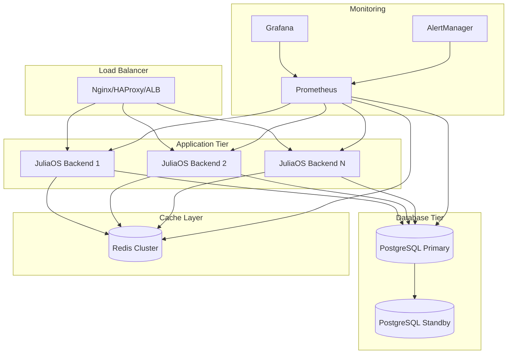

# JuliaSphere Production Deployment Guide

This guide provides detailed instructions for deploying JuliaSphere in production environments with high availability, security, and scalability considerations.

## Table of Contents

1. [Architecture Overview](#architecture-overview)
2. [Infrastructure Requirements](#infrastructure-requirements)
3. [Container Deployment](#container-deployment)
4. [Cloud Provider Guides](#cloud-provider-guides)
5. [Load Balancing & Scaling](#load-balancing--scaling)
6. [Security Configuration](#security-configuration)
7. [Monitoring & Logging](#monitoring--logging)
8. [Backup & Disaster Recovery](#backup--disaster-recovery)
9. [CI/CD Pipeline](#cicd-pipeline)
10. [Performance Optimization](#performance-optimization)

## Architecture Overview

### Production Architecture Components



### Key Production Components

1. **Load Balancer**: Distributes traffic across multiple backend instances
2. **Application Servers**: Multiple JuliaOS backend instances for redundancy
3. **Database**: PostgreSQL with primary/standby replication
4. **Cache Layer**: Redis for session storage and caching
5. **Monitoring Stack**: Prometheus, Grafana, and AlertManager
6. **Reverse Proxy**: Nginx for SSL termination and static file serving

## Infrastructure Requirements

### Minimum Production Requirements

| Component | Minimum Specs | Recommended |
|-----------|---------------|-------------|
| **Load Balancer** | 1 vCPU, 1GB RAM | 2 vCPU, 4GB RAM |
| **Backend Instances** | 2 vCPU, 4GB RAM | 4 vCPU, 8GB RAM |
| **Database Primary** | 2 vCPU, 8GB RAM | 4 vCPU, 16GB RAM |
| **Database Standby** | 2 vCPU, 8GB RAM | 4 vCPU, 16GB RAM |
| **Redis Cache** | 1 vCPU, 2GB RAM | 2 vCPU, 4GB RAM |
| **Monitoring** | 2 vCPU, 4GB RAM | 4 vCPU, 8GB RAM |

### Storage Requirements

- **Database**: 100GB+ SSD with 3,000 IOPS minimum
- **Logs**: 50GB+ with log rotation configured
- **Backups**: 3x database size for retention
- **Application**: 20GB per backend instance

### Network Configuration

- **Ports**: 80/443 (HTTP/HTTPS), 8052 (Backend), 5432 (PostgreSQL), 6379 (Redis)
- **Security Groups**: Restrict database and cache access to application tier only
- **SSL/TLS**: Use certificates from trusted CA (Let's Encrypt, AWS Certificate Manager)

## Container Deployment

### Docker Production Stack

1. **Create production Docker Compose**:
   ```yaml
   # docker-compose.prod.yml
   version: '3.8'
   
   services:
     # Load Balancer
     nginx:
       image: nginx:alpine
       container_name: juliaos-nginx
       ports:
         - "80:80"
         - "443:443"
       volumes:
         - ./nginx/nginx.conf:/etc/nginx/nginx.conf:ro
         - ./nginx/ssl:/etc/nginx/ssl:ro
       depends_on:
         - backend-1
         - backend-2
       restart: unless-stopped
       
     # Backend Instances
     backend-1:
       build: .
       container_name: juliaos-backend-1
       env_file:
         - .env.prod
       environment:
         - INSTANCE_ID=backend-1
         - JULIA_NUM_THREADS=4
       restart: unless-stopped
       depends_on:
         - postgres-primary
         - redis
       healthcheck:
         test: ["CMD", "curl", "-f", "http://localhost:8052/health"]
         interval: 30s
         timeout: 10s
         retries: 3
         
     backend-2:
       build: .
       container_name: juliaos-backend-2
       env_file:
         - .env.prod
       environment:
         - INSTANCE_ID=backend-2
         - JULIA_NUM_THREADS=4
       restart: unless-stopped
       depends_on:
         - postgres-primary
         - redis
       healthcheck:
         test: ["CMD", "curl", "-f", "http://localhost:8052/health"]
         interval: 30s
         timeout: 10s
         retries: 3
         
     # Database
     postgres-primary:
       image: postgres:17
       container_name: juliaos-postgres-primary
       environment:
         POSTGRES_USER: ${DB_USER}
         POSTGRES_PASSWORD: ${DB_PASSWORD}
         POSTGRES_DB: ${DB_NAME}
         POSTGRES_INITDB_ARGS: "--auth-host=md5"
       volumes:
         - postgres_data:/var/lib/postgresql/data
         - ./postgres/postgresql.conf:/etc/postgresql/postgresql.conf
         - ./postgres/pg_hba.conf:/etc/postgresql/pg_hba.conf
         - ./migrations:/docker-entrypoint-initdb.d
       command: postgres -c config_file=/etc/postgresql/postgresql.conf
       restart: unless-stopped
       healthcheck:
         test: ["CMD-SHELL", "pg_isready -U ${DB_USER}"]
         interval: 10s
         timeout: 5s
         retries: 5
         
     # Cache
     redis:
       image: redis:7-alpine
       container_name: juliaos-redis
       command: redis-server --appendonly yes --requirepass ${REDIS_PASSWORD}
       volumes:
         - redis_data:/data
       restart: unless-stopped
       healthcheck:
         test: ["CMD", "redis-cli", "ping"]
         interval: 10s
         timeout: 3s
         retries: 5
         
     # Monitoring
     prometheus:
       image: prom/prometheus:latest
       container_name: juliaos-prometheus
       volumes:
         - ./monitoring/prometheus.yml:/etc/prometheus/prometheus.yml
         - prometheus_data:/prometheus
       command:
         - '--config.file=/etc/prometheus/prometheus.yml'
         - '--storage.tsdb.path=/prometheus'
         - '--web.console.libraries=/etc/prometheus/console_libraries'
         - '--web.console.templates=/etc/prometheus/consoles'
         - '--web.enable-lifecycle'
       restart: unless-stopped
       
     grafana:
       image: grafana/grafana:latest
       container_name: juliaos-grafana
       environment:
         - GF_SECURITY_ADMIN_PASSWORD=${GRAFANA_PASSWORD}
       volumes:
         - grafana_data:/var/lib/grafana
         - ./monitoring/grafana:/etc/grafana/provisioning
       ports:
         - "3000:3000"
       restart: unless-stopped
   
   volumes:
     postgres_data:
     redis_data:
     prometheus_data:
     grafana_data:
   ```

2. **Nginx Configuration**:
   ```nginx
   # nginx/nginx.conf
   events {
       worker_connections 1024;
   }
   
   http {
       upstream backend {
           least_conn;
           server backend-1:8052 max_fails=3 fail_timeout=30s;
           server backend-2:8052 max_fails=3 fail_timeout=30s;
       }
       
       # Rate limiting
       limit_req_zone $binary_remote_addr zone=api:10m rate=10r/s;
       
       server {
           listen 80;
           server_name your-domain.com;
           return 301 https://$server_name$request_uri;
       }
       
       server {
           listen 443 ssl http2;
           server_name your-domain.com;
           
           # SSL Configuration
           ssl_certificate /etc/nginx/ssl/cert.pem;
           ssl_certificate_key /etc/nginx/ssl/key.pem;
           ssl_protocols TLSv1.2 TLSv1.3;
           ssl_ciphers HIGH:!aNULL:!MD5;
           
           # Security Headers
           add_header X-Frame-Options "SAMEORIGIN" always;
           add_header X-Content-Type-Options "nosniff" always;
           add_header X-XSS-Protection "1; mode=block" always;
           add_header Referrer-Policy "strict-origin-when-cross-origin" always;
           add_header Content-Security-Policy "default-src 'self'" always;
           
           # Rate limiting
           limit_req zone=api burst=20 nodelay;
           
           location / {
               proxy_pass http://backend;
               proxy_set_header Host $host;
               proxy_set_header X-Real-IP $remote_addr;
               proxy_set_header X-Forwarded-For $proxy_add_x_forwarded_for;
               proxy_set_header X-Forwarded-Proto $scheme;
               
               # Health check exclusion from rate limiting
               location /health {
                   limit_req off;
                   proxy_pass http://backend;
               }
           }
       }
   }
   ```

3. **PostgreSQL Configuration**:
   ```ini
   # postgres/postgresql.conf
   # Memory Settings
   shared_buffers = 256MB
   effective_cache_size = 1GB
   work_mem = 4MB
   maintenance_work_mem = 64MB
   
   # WAL Settings
   wal_level = replica
   max_wal_senders = 3
   wal_keep_segments = 32
   
   # Connection Settings
   max_connections = 100
   
   # Performance Settings
   random_page_cost = 1.1
   effective_io_concurrency = 200
   
   # Logging
   log_statement = 'mod'
   log_min_duration_statement = 1000
   ```

## Cloud Provider Guides

### AWS Deployment

#### Using ECS (Elastic Container Service)

1. **Create ECS Cluster**:
   ```bash
   aws ecs create-cluster --cluster-name juliaos-prod
   ```

2. **Build and Push Images**:
   ```bash
   # Build image
   docker build -t juliaos-backend .
   
   # Tag for ECR
   docker tag juliaos-backend:latest \
     123456789012.dkr.ecr.us-west-2.amazonaws.com/juliaos-backend:latest
   
   # Push to ECR
   aws ecr get-login-password --region us-west-2 | docker login --username AWS --password-stdin \
     123456789012.dkr.ecr.us-west-2.amazonaws.com
   docker push 123456789012.dkr.ecr.us-west-2.amazonaws.com/juliaos-backend:latest
   ```

3. **ECS Task Definition**:
   ```json
   {
     "family": "juliaos-backend",
     "networkMode": "awsvpc",
     "requiresCompatibilities": ["FARGATE"],
     "cpu": "1024",
     "memory": "2048",
     "executionRoleArn": "arn:aws:iam::123456789012:role/ecsTaskExecutionRole",
     "containerDefinitions": [
       {
         "name": "juliaos-backend",
         "image": "123456789012.dkr.ecr.us-west-2.amazonaws.com/juliaos-backend:latest",
         "portMappings": [
           {
             "containerPort": 8052,
             "protocol": "tcp"
           }
         ],
         "environment": [
           {"name": "HOST", "value": "0.0.0.0"},
           {"name": "PORT", "value": "8052"}
         ],
         "secrets": [
           {"name": "DB_PASSWORD", "valueFrom": "arn:aws:secretsmanager:..."}
         ],
         "logConfiguration": {
           "logDriver": "awslogs",
           "options": {
             "awslogs-group": "/ecs/juliaos-backend",
             "awslogs-region": "us-west-2",
             "awslogs-stream-prefix": "ecs"
           }
         }
       }
     ]
   }
   ```

4. **Application Load Balancer**:
   ```bash
   # Create ALB
   aws elbv2 create-load-balancer \
     --name juliaos-alb \
     --subnets subnet-12345 subnet-67890 \
     --security-groups sg-12345
   
   # Create target group
   aws elbv2 create-target-group \
     --name juliaos-targets \
     --protocol HTTP \
     --port 8052 \
     --vpc-id vpc-12345 \
     --target-type ip
   ```

#### Using RDS for Database

1. **Create RDS Instance**:
   ```bash
   aws rds create-db-instance \
     --db-instance-identifier juliaos-db \
     --db-instance-class db.t3.medium \
     --engine postgres \
     --master-username postgres \
     --master-user-password your-secure-password \
     --allocated-storage 100 \
     --storage-type gp2 \
     --vpc-security-group-ids sg-database \
     --db-subnet-group-name juliaos-db-subnet-group \
     --backup-retention-period 7 \
     --multi-az
   ```

### Google Cloud Platform

#### Using Cloud Run

1. **Build and Deploy**:
   ```bash
   # Build with Cloud Build
   gcloud builds submit --tag gcr.io/PROJECT-ID/juliaos-backend
   
   # Deploy to Cloud Run
   gcloud run deploy juliaos-backend \
     --image gcr.io/PROJECT-ID/juliaos-backend \
     --platform managed \
     --region us-central1 \
     --allow-unauthenticated \
     --set-env-vars HOST=0.0.0.0,PORT=8080 \
     --memory 2Gi \
     --cpu 2
   ```

2. **Cloud SQL Setup**:
   ```bash
   # Create Cloud SQL instance
   gcloud sql instances create juliaos-db \
     --database-version=POSTGRES_13 \
     --tier=db-standard-2 \
     --region=us-central1 \
     --backup-start-time=03:00 \
     --enable-bin-log
   ```

### Digital Ocean

#### Using App Platform

1. **App Spec Configuration**:
   ```yaml
   # .do/app.yaml
   name: juliaos
   services:
   - name: backend
     source_dir: /backend
     github:
       repo: your-username/juliaos
       branch: main
     run_command: julia --project=. run_server.jl
     environment_slug: ubuntu-18
     instance_count: 2
     instance_size_slug: basic-s
     envs:
     - key: HOST
       value: "0.0.0.0"
     - key: PORT
       value: "8080"
     - key: DB_HOST
       value: ${db.HOSTNAME}
     - key: DB_USER
       value: ${db.USERNAME}
     - key: DB_PASSWORD
       value: ${db.PASSWORD}
     - key: DB_NAME
       value: ${db.DATABASE}
   databases:
   - engine: PG
     name: db
     num_nodes: 1
     size: db-s-1vcpu-1gb
     version: "13"
   ```

## Load Balancing & Scaling

### Horizontal Pod Autoscaler (Kubernetes)

```yaml
# hpa.yaml
apiVersion: autoscaling/v2
kind: HorizontalPodAutoscaler
metadata:
  name: juliaos-backend-hpa
spec:
  scaleTargetRef:
    apiVersion: apps/v1
    kind: Deployment
    name: juliaos-backend
  minReplicas: 2
  maxReplicas: 10
  metrics:
  - type: Resource
    resource:
      name: cpu
      target:
        type: Utilization
        averageUtilization: 70
  - type: Resource
    resource:
      name: memory
      target:
        type: Utilization
        averageUtilization: 80
```

### Auto Scaling Groups (AWS)

```json
{
  "AutoScalingGroupName": "juliaos-backend-asg",
  "MinSize": 2,
  "MaxSize": 10,
  "DesiredCapacity": 2,
  "LaunchTemplate": {
    "LaunchTemplateName": "juliaos-backend-lt",
    "Version": "$Latest"
  },
  "TargetGroupARNs": ["arn:aws:elasticloadbalancing:..."],
  "HealthCheckType": "ELB",
  "HealthCheckGracePeriod": 300
}
```

## Security Configuration

### SSL/TLS Configuration

1. **Let's Encrypt with Certbot**:
   ```bash
   # Install certbot
   sudo apt install certbot python3-certbot-nginx
   
   # Get certificate
   sudo certbot --nginx -d your-domain.com
   
   # Auto-renewal
   sudo crontab -e
   # Add: 0 12 * * * /usr/bin/certbot renew --quiet
   ```

### Environment Security

1. **Secrets Management**:
   ```bash
   # AWS Secrets Manager
   aws secretsmanager create-secret \
     --name juliaos/prod/database \
     --description "Database credentials" \
     --secret-string '{"username":"postgres","password":"secure_password"}'
   
   # Kubernetes Secrets
   kubectl create secret generic juliaos-secrets \
     --from-literal=db-password=secure_password \
     --from-literal=redis-password=secure_redis_password
   ```

2. **Network Security**:
   ```yaml
   # Security Groups (AWS)
   SecurityGroupRules:
     - IpProtocol: tcp
       FromPort: 443
       ToPort: 443
       CidrIp: 0.0.0.0/0
     - IpProtocol: tcp
       FromPort: 8052
       ToPort: 8052
       SourceSecurityGroupId: sg-loadbalancer
   ```

### Authentication & Authorization

1. **API Key Management**:
   ```julia
   # backend/src/auth/api_keys.jl
   function validate_api_key(request)
       api_key = get_header(request, "X-API-Key")
       return api_key in VALID_API_KEYS
   end
   ```

2. **JWT Configuration**:
   ```julia
   # backend/src/auth/jwt.jl
   const JWT_SECRET = ENV["JWT_SECRET"]
   const JWT_EXPIRY = 3600  # 1 hour
   ```

## Monitoring & Logging

### Prometheus Configuration

```yaml
# monitoring/prometheus.yml
global:
  scrape_interval: 15s

scrape_configs:
  - job_name: 'juliaos-backend'
    static_configs:
      - targets: ['backend-1:8052', 'backend-2:8052']
    metrics_path: /metrics
    scrape_interval: 30s
    
  - job_name: 'postgres'
    static_configs:
      - targets: ['postgres-primary:9187']
      
  - job_name: 'redis'
    static_configs:
      - targets: ['redis:9121']
```

### Grafana Dashboards

```json
{
  "dashboard": {
    "title": "JuliaOS Production Dashboard",
    "panels": [
      {
        "title": "Request Rate",
        "targets": [
          {
            "expr": "rate(http_requests_total[5m])"
          }
        ]
      },
      {
        "title": "Response Time",
        "targets": [
          {
            "expr": "histogram_quantile(0.95, rate(http_request_duration_seconds_bucket[5m]))"
          }
        ]
      }
    ]
  }
}
```

### Log Aggregation

1. **ELK Stack Setup**:
   ```yaml
   # docker-compose.logging.yml
   elasticsearch:
     image: docker.elastic.co/elasticsearch/elasticsearch:7.14.0
     environment:
       - discovery.type=single-node
       - "ES_JAVA_OPTS=-Xms512m -Xmx512m"
   
   kibana:
     image: docker.elastic.co/kibana/kibana:7.14.0
     ports:
       - "5601:5601"
     depends_on:
       - elasticsearch
   
   logstash:
     image: docker.elastic.co/logstash/logstash:7.14.0
     volumes:
       - ./logstash/pipeline:/usr/share/logstash/pipeline
   ```

### Alerting Rules

```yaml
# monitoring/alerts.yml
groups:
- name: juliaos-alerts
  rules:
  - alert: HighErrorRate
    expr: rate(http_requests_total{status=~"5.."}[5m]) > 0.1
    for: 5m
    labels:
      severity: critical
    annotations:
      summary: "High error rate detected"
      
  - alert: DatabaseDown
    expr: up{job="postgres"} == 0
    for: 1m
    labels:
      severity: critical
    annotations:
      summary: "Database is down"
```

## Backup & Disaster Recovery

### Database Backups

1. **Automated PostgreSQL Backups**:
   ```bash
   #!/bin/bash
   # backup.sh
   BACKUP_DIR="/backups"
   DATE=$(date +%Y%m%d_%H%M%S)
   DB_NAME="juliaos"
   
   # Create backup
   pg_dump -h $DB_HOST -U $DB_USER $DB_NAME | gzip > "$BACKUP_DIR/juliaos_$DATE.sql.gz"
   
   # Cleanup old backups (keep last 7 days)
   find $BACKUP_DIR -name "juliaos_*.sql.gz" -mtime +7 -delete
   
   # Upload to S3
   aws s3 cp "$BACKUP_DIR/juliaos_$DATE.sql.gz" s3://your-backup-bucket/database/
   ```

2. **Backup Verification**:
   ```bash
   #!/bin/bash
   # verify-backup.sh
   LATEST_BACKUP=$(ls -t /backups/juliaos_*.sql.gz | head -1)
   
   # Test restore to temporary database
   createdb test_restore
   gunzip -c $LATEST_BACKUP | psql test_restore
   
   # Verify data integrity
   psql test_restore -c "SELECT COUNT(*) FROM agents;"
   
   # Cleanup
   dropdb test_restore
   ```

### Application Recovery

1. **Blue-Green Deployment**:
   ```bash
   #!/bin/bash
   # deploy.sh
   CURRENT_ENV=$(curl -s http://your-domain.com/health | jq -r '.environment')
   
   if [ "$CURRENT_ENV" == "blue" ]; then
       NEW_ENV="green"
   else
       NEW_ENV="blue"
   fi
   
   # Deploy to inactive environment
   docker-compose -f docker-compose.$NEW_ENV.yml up -d
   
   # Health check
   ./health-check.sh $NEW_ENV
   
   # Switch traffic
   ./switch-traffic.sh $NEW_ENV
   ```

## CI/CD Pipeline

### GitHub Actions

```yaml
# .github/workflows/deploy.yml
name: Deploy to Production

on:
  push:
    branches: [main]

jobs:
  test:
    runs-on: ubuntu-latest
    steps:
    - uses: actions/checkout@v2
    - name: Setup Julia
      uses: julia-actions/setup-julia@v1
      with:
        version: 1.11.4
    - name: Run tests
      run: |
        cd backend
        julia --project=. -e "using Pkg; Pkg.test()"

  build-and-deploy:
    needs: test
    runs-on: ubuntu-latest
    if: github.ref == 'refs/heads/main'
    steps:
    - uses: actions/checkout@v2
    
    - name: Configure AWS credentials
      uses: aws-actions/configure-aws-credentials@v1
      with:
        aws-access-key-id: ${{ secrets.AWS_ACCESS_KEY_ID }}
        aws-secret-access-key: ${{ secrets.AWS_SECRET_ACCESS_KEY }}
        aws-region: us-west-2
    
    - name: Build and push Docker image
      run: |
        aws ecr get-login-password | docker login --username AWS --password-stdin 123456789012.dkr.ecr.us-west-2.amazonaws.com
        docker build -t juliaos-backend backend/
        docker tag juliaos-backend:latest 123456789012.dkr.ecr.us-west-2.amazonaws.com/juliaos-backend:${{ github.sha }}
        docker push 123456789012.dkr.ecr.us-west-2.amazonaws.com/juliaos-backend:${{ github.sha }}
    
    - name: Deploy to ECS
      run: |
        aws ecs update-service --cluster juliaos-prod --service juliaos-backend --force-new-deployment
```

## Performance Optimization

### Julia Backend Optimization

1. **Julia Configuration**:
   ```bash
   # Environment variables for production
   export JULIA_NUM_THREADS=4
   export JULIA_CPU_TARGET="generic"
   export JULIA_DEPOT_PATH="/opt/julia/depot"
   ```

2. **Memory Management**:
   ```julia
   # backend/src/config/performance.jl
   function configure_gc()
       # Tune garbage collection for production
       GC.enable_logging(false)  # Disable GC logging in production
   end
   ```

### Database Optimization

1. **Connection Pooling**:
   ```julia
   # backend/src/db/pool.jl
   const CONNECTION_POOL = Pool(
       () -> connect_to_db(),
       max_connections=20,
       max_idle_connections=5,
       connection_timeout=30
   )
   ```

2. **Query Optimization**:
   ```sql
   -- Create indexes for common queries
   CREATE INDEX CONCURRENTLY idx_agents_status ON agents(status);
   CREATE INDEX CONCURRENTLY idx_agent_executions_timestamp ON agent_executions(created_at);
   CREATE INDEX CONCURRENTLY idx_agents_user_id ON agents(user_id);
   ```

### Caching Strategy

```julia
# backend/src/cache/redis_cache.jl
function get_cached_agent(agent_id::String)
    cache_key = "agent:$(agent_id)"
    cached = Redis.get(cache_key)
    
    if cached !== nothing
        return JSON3.read(cached, Agent)
    end
    
    # Cache miss - fetch from database
    agent = get_agent_from_db(agent_id)
    Redis.setex(cache_key, 300, JSON3.write(agent))  # Cache for 5 minutes
    
    return agent
end
```

---

This production deployment guide provides comprehensive instructions for deploying JuliaSphere at scale with enterprise-grade reliability, security, and performance. Regular monitoring and maintenance following these guidelines will ensure optimal operation in production environments.